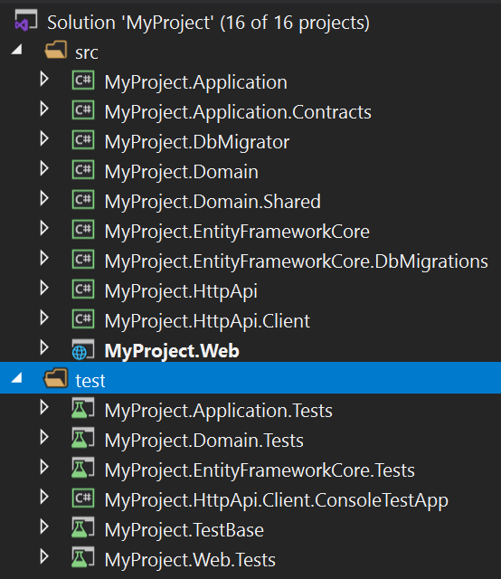
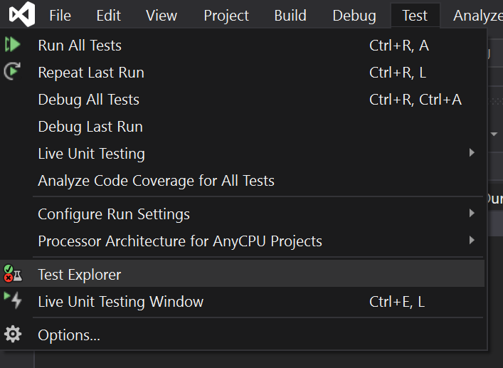
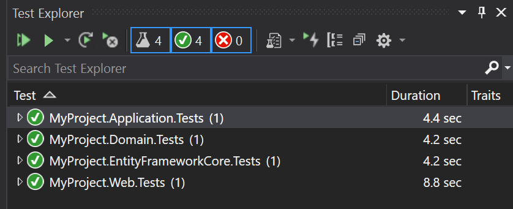
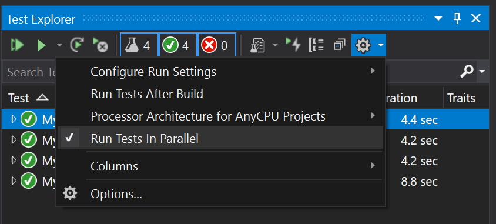
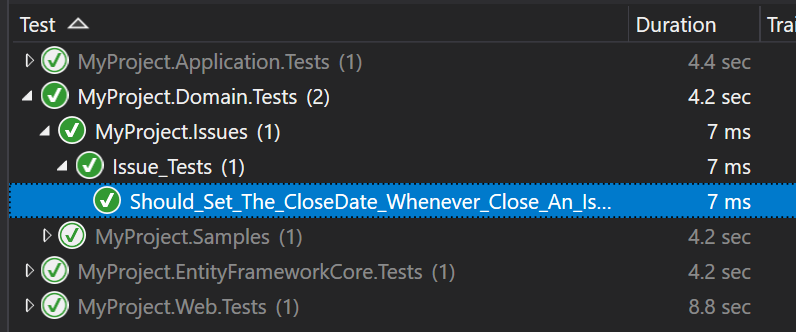

# Testes Automatizados

## Introdução

O ABP Framework foi desenvolvido com testabilidade em mente. Existem alguns níveis diferentes de testes automatizados;

* **Teste de Unidade**: Tipicamente, você testa uma única classe (ou algumas classes juntas). Esses testes serão rápido. Porém, você normalmente irá lidar com dados "mockados" para as dependências do(s) seu(s) serviço(s).

* **Teste de Integração**: Você normalmente vai testar um serviço, mas dessa vez você não vai "mockar" a infraestrutura base e os serviços com objetivo de verificar se estão trabalhando bem juntos.

* **Testes de UI**: Você testa a interface (UI) da sua aplicação, como os usuários iriam interagir com a sua aplicação.

### Teste de Unidade vs Testes de Integração

Testes de integração possuem algumas **vantagens** significativas comparadas aos testes de unidade; 

* **Fácil de escrever** já que você não terá o trabalho de "mockar" e lidar com suas dependências.
* Seu código de teste com todos os serviços reais e infraestrutura (incluindo mapeamento da base de dados e queries), serão muito mais próximos da **aplicação de teste real**
* Your test code runs with all the real services and infrastructure (including database mapping and queries), so it is much closer to the **real application test**.

E algumas desvantagens;

* Eles são mais **lentos** se comparados com os testes de unidade já que toda a infraestrutura é preparada para cada caso de teste.
* Um bug em um serviço pode quebrar vários casos de testes, logo, pode ser mais **difícil encontrar o problema real** em alguns casos.

Nós sugerimos uma abordagem mista: Escreva testes de unidade ou de integração onde é necessário e onde você acha efetivo de escrever e de manter. 

## Modelo de inicialização do aplicativo

O [Modelo de inicialização do aplicativo](Startup-Templates/Application.md) vem com a infraestutura de testes devidamente instalada e configurada para você.

### Os Projetos de Teste

Veja a estrutura da solução a seguir no Visual Studio: 



Existe mais de um projeto de teste, organizado por camadas; 

* `Domain.Tests` é utilizado para testar os objetos da sua camada de Domínio (como os [Serviços do Domínio](Domain-Services.md) e [Entidades](Entities.md)).
* `Application.Tests` é utilizado para testar a sua Camada de Aplicação (com os [Serivços de Aplicação](Application-Services.md)).
* `EntityFrameworkCore.Tests` é utilziado para testar suas implementações customizadas de repositórios ou os mapeamentos EF Core (Esse projeto vai ser diferente se você utilizar outro [Provedor de Banco de Dados](Data-Access.md)).
* `Web.Tests` é utilizado para testar a camada de interface (como Páginas, Controladores e Componentes da View). Esse projeto existe somente para MVC / Aplicações Razor Page
* `TestBase` contem algumas classes que são compartilhadas/utilizadas por outros projetos.

> `HttpApi.Client.ConsoleTestApp` não é uma aplicação de testes automatizados. É um exemplo de Console Application que mostra como consumir as suas APIs HTTP de uma aplicação .NET Console.

As próxiams seção vão apresentar as classes base e outras infraestruturas incluídas nesses projetos.

### A Infraestrutura de Teste

The startup solution has the following libraries already installed;
A solução inicial possui as seguintes bibliotecas já instaladas;

* [xUnit](https://xunit.net/) como framework de teste.
* [NSubstitute](https://nsubstitute.github.io/) como biblioteca de mocking.
* [Shouldly](https://github.com/shouldly/shouldly) como a biblioteca de asserção.

Você é livre para substituí-las com suas ferramentas favoritas, mas esse documento e exemplos utilizarão como base essas ferramentas.

## O Explorador de Testes

Você pode utilizar o Explorador de Testes para visualizar e rodar os testes no Visual Studio. Para outras IDEs, veja a sua própria documentação.

### Abra o Explorador de Testes

Abra o *Explorador de Testes*, no menu de *Testes*, se ele já não estiver aberto.



### Executando os Testes

Então você pode clicar nos botões "Run All" ou "Run" para executar os testes. O template inicial já possui alguns exemplos de testes para você.



### Executando Testes em Paralelo

A infraestrutura de teste permite que você execute os testes em paralelo. É **fortemente sugerido** que você rode todos os testes em paralelo, que é bem mais rápido que executá-los um por vez.

Para habilitar, clique no ícone da seta perto do botão de configurações (engrenagem) e selecione *Run Tests In Parallel*.



## Testes de Unidade

Para os Testes de Unidade, você não precisa de muita infraestrutura. Você normalmente instancia sua classe e fornece alguna objetos "mockados" pré configurados para preparar seu objeto para teste.

### Classes sem dependências.

No caso mais simples, a classe que você quer testar não irá possuir dependências. Nesse caso, você pode instanciar diretamente sua classe, chamar seus métodos e fazer suas asserções.

#### Exemplo: Testando uma Entidade

Assumindo que você possui uma [entidade](Entities.md) `Issue` como mostrado a seguir:

````csharp
using System;
using Volo.Abp.Domain.Entities;

namespace MyProject.Issues
{
    public class Issue : AggregateRoot<Guid>
    {
        public string Title { get; set; }
        public string Description { get; set; }
        public bool IsLocked { get; set; }
        public bool IsClosed { get; private set; }
        public DateTime? CloseDate { get; private set; }

        public void Close()
        {
            IsClosed = true;
            CloseDate = DateTime.UtcNow;
        }

        public void Open()
        {
            if (!IsClosed)
            {
                return;
            }

            if (IsLocked)
            {
                throw new IssueStateException("You can not open a locked issue!");
            }

            IsClosed = true;
            CloseDate = null;
        }
    }
}

````
Perceba que as propriedades `IsClosed` e `Close Date` possui setters privados para forçar algumas regras de negócio através da utilização dos métodos `Open()` e `Close()`;

* Sempre que você fechar uma issue, a `CloseDate` deve definir o [tempo atual](Timing.md).
* Uma issue não pode ser reaberta se está trancada. E se ela for reaberta, a `CloseDate` deveria ser definida como `null`.

Já que a entidade `Issue` é parte da Camada de Domínio, nós deveríamos testá-la no projeto `Domain.Testes`. Cria uma classe `Issue_Testes` dentro do seu projeto `Domain.Testes`.


````csharp
using Shouldly;
using Xunit;

namespace MyProject.Issues
{
    public class Issue_Tests
    {
        [Fact]
        public void Should_Set_The_CloseDate_Whenever_Close_An_Issue()
        {
            // Arrange

            var issue = new Issue();
            issue.CloseDate.ShouldBeNull(); // null at the beginning

            // Act

            issue.Close();

            // Assert

            issue.IsClosed.ShouldBeTrue();
            issue.CloseDate.ShouldNotBeNull();
        }
    }
}
````
Esse teste segue o padrão AAA (Arrange-Act-Assert) (Arranjar, Agir e Assertar);

* A parte de **Arrange(Arranjar)** cria uma entidade `Issue` e assegura que `CloseDate` é `null` no início.
* A parte de **Act(Agir)** executa o método que queremos testar nesse caso.
* A parte de **Assert(Assertar)** verifica se as propridades de `Issue` são como as que esperamos que seja.

O atributo `[Fact]` é definido pela biblioteca [xUnit](https://xunit.net/) e marca o método como um método de teste. Os métodos de extensão `Should...` são fornecidos pela biblioteca [Shouldly](https://github.com/shouldly/shouldly). Você pode utilizar diretamente a classe `Assert` do xUnit, mas Shouldly é mais confortável e direto ao ponto.

Quando você executar os testes, você verá que os testes passarão com sucesso:



Vamos adicionar mais dois métodos de teste: 

````csharp
[Fact]
public void Should_Allow_To_ReOpen_An_Issue()
{
    // Arrange

    var issue = new Issue();
    issue.Close();

    // Act

    issue.Open();

    // Assert

    issue.IsClosed.ShouldBeFalse();
    issue.CloseDate.ShouldBeNull();
}

[Fact]
public void Should_Not_Allow_To_ReOpen_A_Locked_Issue()
{
    // Arrange

    var issue = new Issue();
    issue.Close();
    issue.IsLocked = true;

    // Act & Assert

    Assert.Throws<IssueStateException>(() =>
    {
        issue.Open();
    });
}
````
`Assert.Throws` verifica se o código executado lança a exeção correspondente.

> Veja as documentações da xUnit e Shoudly para aprender mais sobre essas biliotecas.

### Classes com dependências

Se seu serviço possui dependências e você quer testar esse serviço, você precisará mockar essas dependências.

#### Example: Testing a Domain Service

Assume that you've an `IssueManager` [Domain Service](Domain-Services.md) that is defined as below:

````csharp
using System;
using System.Threading.Tasks;
using Volo.Abp;
using Volo.Abp.Domain.Services;

namespace MyProject.Issues
{
    public class IssueManager : DomainService
    {
        public const int MaxAllowedOpenIssueCountForAUser = 3;

        private readonly IIssueRepository _issueRepository;

        public IssueManager(IIssueRepository issueRepository)
        {
            _issueRepository = issueRepository;
        }

        public async Task AssignToUserAsync(Issue issue, Guid userId)
        {
            var issueCount = await _issueRepository.GetIssueCountOfUserAsync(userId);

            if (issueCount >= MaxAllowedOpenIssueCountForAUser)
            {
                throw new BusinessException(
                    code: "IM:00392",
                    message: $"You can not assign more" +
                             $"than {MaxAllowedOpenIssueCountForAUser} issues to a user!"
                );
            }

            issue.AssignedUserId = userId;
        }
    }
}
````

`IssueManager` depends on the `IssueRepository` service, that will be mocked in this example.

**Business Rule**: The example `AssignToUserAsync` doesn't allow to assign more than 3 (`MaxAllowedOpenIssueCountForAUser` constant) issues to a user. If you want to assign an issue in this case, you first need to unassign an existing issue.

The test case below tries to make a valid assignment:

````csharp
using System;
using System.Threading.Tasks;
using NSubstitute;
using Shouldly;
using Volo.Abp;
using Xunit;

namespace MyProject.Issues
{
    public class IssueManager_Tests
    {
        [Fact]
        public async Task Should_Assign_An_Issue_To_A_User()
        {
            // Arrange

            var userId = Guid.NewGuid();

            var fakeRepo = Substitute.For<IIssueRepository>();
            fakeRepo.GetIssueCountOfUserAsync(userId).Returns(1);

            var issueManager = new IssueManager(fakeRepo);

            var issue = new Issue();

            // Act

            await issueManager.AssignToUserAsync(issue, userId);

            //Assert

            issue.AssignedUserId.ShouldBe(userId);
            await fakeRepo.Received(1).GetIssueCountOfUserAsync(userId);
        }
    }
}
````

* `Substitute.For<IIssueRepository>` creates a mock (fake) object that is passed into the `IssueManager` constructor.
* `fakeRepo.GetIssueCountOfUserAsync(userId).Returns(1)` ensures that the `GetIssueCountOfUserAsync` method of the repository returns `1`.
* `issueManager.AssignToUserAsync` doesn't throw any exception since the repository returns `1` for the currently assigned issue count.
* `issue.AssignedUserId.ShouldBe(userId);` line checks if the `AssignedUserId` has the correct value.
* `await fakeRepo.Received(1).GetIssueCountOfUserAsync(userId);` checks if the `IssueManager` called the `GetIssueCountOfUserAsync` method exactly one time.

Let's add a second test to see if it prevents to assign issues to a user more than the allowed count:

````csharp
[Fact]
public async Task Should_Not_Allow_To_Assign_Issues_Over_The_Limit()
{
    // Arrange

    var userId = Guid.NewGuid();

    var fakeRepo = Substitute.For<IIssueRepository>();
    fakeRepo
        .GetIssueCountOfUserAsync(userId)
        .Returns(IssueManager.MaxAllowedOpenIssueCountForAUser);

    var issueManager = new IssueManager(fakeRepo);

    // Act & Assert

    var issue = new Issue();

    await Assert.ThrowsAsync<BusinessException>(async () =>
    {
        await issueManager.AssignToUserAsync(issue, userId);
    });

    issue.AssignedUserId.ShouldBeNull();
    await fakeRepo.Received(1).GetIssueCountOfUserAsync(userId);
}
````

> For more information on the mocking, see the [NSubstitute](https://nsubstitute.github.io/) documentation.

It is relatively easy to mock a single dependency. But, when your dependencies grow, it gets harder to setup the test objects and mock all the dependencies. See the *Integration Tests* section that doesn't require mocking the dependencies.

### Tip: Share the Test Class Constructor

[xUnit](https://xunit.net/) creates a **new test class instance** (`IssueManager_Tests` for this example) for each test method. So, you can move some *Arrange* code into the constructor to reduce the code duplication. The constructor will be executed for each test case and doesn't affect each other, even if they work in parallel.

**Example: Refactor the `IssueManager_Tests` to reduce the code duplication**

````csharp
using System;
using System.Threading.Tasks;
using NSubstitute;
using Shouldly;
using Volo.Abp;
using Xunit;

namespace MyProject.Issues
{
    public class IssueManager_Tests
    {
        private readonly Guid _userId;
        private readonly IIssueRepository _fakeRepo;
        private readonly IssueManager _issueManager;
        private readonly Issue _issue;

        public IssueManager_Tests()
        {
            _userId = Guid.NewGuid();
            _fakeRepo = Substitute.For<IIssueRepository>();
            _issueManager = new IssueManager(_fakeRepo);
            _issue = new Issue();
        }

        [Fact]
        public async Task Should_Assign_An_Issue_To_A_User()
        {
            // Arrange            
            _fakeRepo.GetIssueCountOfUserAsync(_userId).Returns(1);

            // Act
            await _issueManager.AssignToUserAsync(_issue, _userId);

            //Assert
            _issue.AssignedUserId.ShouldBe(_userId);
            await _fakeRepo.Received(1).GetIssueCountOfUserAsync(_userId);
        }

        [Fact]
        public async Task Should_Not_Allow_To_Assign_Issues_Over_The_Limit()
        {
            // Arrange
            _fakeRepo
                .GetIssueCountOfUserAsync(_userId)
                .Returns(IssueManager.MaxAllowedOpenIssueCountForAUser);

            // Act & Assert
            await Assert.ThrowsAsync<BusinessException>(async () =>
            {
                await _issueManager.AssignToUserAsync(_issue, _userId);
            });

            _issue.AssignedUserId.ShouldBeNull();
            await _fakeRepo.Received(1).GetIssueCountOfUserAsync(_userId);
        }
    }
}
````

> Keep your test code clean to create a maintainable test suite.

## Integration Tests

> You can also follow the [web application development tutorial](Tutorials/Part-1.md) to learn developing a full stack application, including the integration tests.

### The Integration Test Infrastructure

ABP Provides a complete infrastructure to write integration tests. All the ABP infrastructure and services will perform in your tests. The application startup template comes with the necessary infrastructure pre-configured for you;

#### The Database

The startup template is configured to use **in-memory SQLite** database for the EF Core (for MongoDB, it uses [Mongo2Go](https://github.com/Mongo2Go/Mongo2Go) library). So, all the configuration and queries are performed against a real database and you can even test database transactions.

Using in-memory SQLite database has two main advantages;

* It is faster compared to an external DBMS.
* It create a **new fresh database** for each test case, so tests doesn't affect each other.

> **Tip**: Do not use EF Core's In-Memory database for advanced integration tests. It is not a real DBMS and has many differences in details. For example, it doesn't support transaction and rollback scenarios, so you can't truly test the failing scenarios. On the other hand, In-Memory SQLite is a real DBMS and supports the fundamental SQL database features.

### The Seed Data

Writing tests against an empty database is not practical. In most cases, you need to some initial data in the database. For example, if you write a test class that query, update and delete the products, it would be helpful to have a few products in the database before executing the test case.

ABP's [Data Seeding](Data-Seeding.md) system is a powerful way to seed the initial data. The application startup template has a *YourProject*TestDataSeedContributor class in the `.TestBase` project. You can fill it to have an initial data that you can use for each test method.

**Example: Create some Issues as the seed data**

````csharp
using System.Threading.Tasks;
using MyProject.Issues;
using Volo.Abp.Data;
using Volo.Abp.DependencyInjection;

namespace MyProject
{
    public class MyProjectTestDataSeedContributor
        : IDataSeedContributor, ITransientDependency
    {
        private readonly IIssueRepository _issueRepository;

        public MyProjectTestDataSeedContributor(IIssueRepository issueRepository)
        {
            _issueRepository = issueRepository;
        }

        public async Task SeedAsync(DataSeedContext context)
        {
            await _issueRepository.InsertAsync(
                new Issue
                {
                    Title = "Test issue one",
                    Description = "Test issue one description",
                    AssignedUserId = TestData.User1Id
                });

            await _issueRepository.InsertAsync(
                new Issue
                {
                    Title = "Test issue two",
                    Description = "Test issue two description",
                    AssignedUserId = TestData.User1Id
                });

            await _issueRepository.InsertAsync(
                new Issue
                {
                    Title = "Test issue three",
                    Description = "Test issue three description",
                    AssignedUserId = TestData.User1Id
                });

            await _issueRepository.InsertAsync(
                new Issue
                {
                    Title = "Test issue four",
                    Description = "Test issue four description",
                    AssignedUserId = TestData.User2Id
                });
        }
    }
}
````

Also created a static class to store the User `Ids`:

````csharp
using System;

namespace MyProject
{
    public static class TestData
    {
        public static Guid User1Id = Guid.Parse("41951813-5CF9-4204-8B18-CD765DBCBC9B");
        public static Guid User2Id = Guid.Parse("2DAB4460-C21B-4925-BF41-A52750A9B999");
    }
}
````

In this way, we can use these known Issues and the User `Id`s to perform the tests.

### Example: Testing a Domain Service

`AbpIntegratedTest<T>` class (defined in the [Volo.Abp.TestBase](https://www.nuget.org/packages/Volo.Abp.TestBase) package) is used to write tests integrated to the ABP Framework. `T` is the Type of the root module to setup and initialize the application.

The application startup template has base classes in each test project, so you can derive from these base classes to make it easier.

See the `IssueManager` tests are re-written as integration tests

````csharp
using System.Threading.Tasks;
using Shouldly;
using Volo.Abp;
using Xunit;

namespace MyProject.Issues
{
    public class IssueManager_Integration_Tests : MyProjectDomainTestBase
    {
        private readonly IssueManager _issueManager;
        private readonly Issue _issue;

        public IssueManager_Integration_Tests()
        {
            _issueManager = GetRequiredService<IssueManager>();
            _issue = new Issue
            {
                Title = "Test title",
                Description = "Test description"
            };
        }

        [Fact]
        public async Task Should_Not_Allow_To_Assign_Issues_Over_The_Limit()
        {
            // Act & Assert
            await Assert.ThrowsAsync<BusinessException>(async () =>
            {
                await _issueManager.AssignToUserAsync(_issue, TestData.User1Id);
            });

            _issue.AssignedUserId.ShouldBeNull();
        }
        
        [Fact]
        public async Task Should_Assign_An_Issue_To_A_User()
        {
            // Act
            await _issueManager.AssignToUserAsync(_issue, TestData.User2Id);

            //Assert
            _issue.AssignedUserId.ShouldBe(TestData.User2Id);
        }
    }
}
````

* First test method assigns the issue to the User 1, which has already assigned to 3 issues in the Data Seed code. So, it throws a `BusinessException`.
* Second test method assigns the issue to User 2, which has only 1 issue assigned. So, the method succeeds.

This class typically locates in the `.Domain.Tests` project since it tests a class located in the `.Domain` project. It is derived from the `MyProjectDomainTestBase` which is already configured to properly run the tests.

Writing such an integration test class is very straightforward. Another benefit is that you won't need to change the test class later when you add another dependency to the `IssueManager` class.

### Example: Testing an Application Service

Testing an [Application Service](Application-Services.md) is not so different. Assume that you've created an `IssueAppService` as defined below:

````csharp
using System.Collections.Generic;
using System.Threading.Tasks;
using Volo.Abp.Application.Services;

namespace MyProject.Issues
{
    public class IssueAppService : ApplicationService, IIssueAppService
    {
        private readonly IIssueRepository _issueRepository;

        public IssueAppService(IIssueRepository issueRepository)
        {
            _issueRepository = issueRepository;
        }

        public async Task<List<IssueDto>> GetListAsync()
        {
            var issues = await _issueRepository.GetListAsync();

            return ObjectMapper.Map<List<Issue>, List<IssueDto>>(issues);
        }
    }
}
````

*(assuming you've also defined the `IIssueAppService` and `IssueDto` and created the [object mapping](Object-To-Object-Mapping.md) between `Issue` and the `IssueDto`)*

Now, you can write a test class inside the `.Application.Tests` project:

````csharp
using System.Threading.Tasks;
using Shouldly;
using Xunit;

namespace MyProject.Issues
{
    public class IssueAppService_Tests : MyProjectApplicationTestBase
    {
        private readonly IIssueAppService _issueAppService;

        public IssueAppService_Tests()
        {
            _issueAppService = GetRequiredService<IIssueAppService>();
        }

        [Fact]
        public async Task Should_Get_All_Issues()
        {
            //Act
            var issueDtos = await _issueAppService.GetListAsync();

            //Assert
            issueDtos.Count.ShouldBeGreaterThan(0);
        }
    }
}
````

It's that simple. This test method tests everything, including the application service, EF Core mapping, object to object mapping and the repository implementation. In this way, you can fully test the Application Layer and the Domain Layer of your solution.

### Dealing with Unit of Work in Integration Tests

ABP's [unit of work](Unit-Of-Work.md) system controls the database connection and transaction management in your application. It seamlessly works while you writing your application code, so you may not aware of it.

In the ABP Framework, all the database operations must be performed inside a unit of work scope. When you test an [application service](Application-Services.md) method, the unit of work scope will be the scope of your application service method. If you are testing a [repository](Repositories.md) method, the unit of work scope will be the scope of your repository method.

In some cases, you may need to manually control the unit of work scope. Consider the following test method:

````csharp
public class IssueRepository_Tests : MyProjectDomainTestBase
{
    private readonly IRepository<Issue, Guid> _issueRepository;

    public IssueRepository_Tests()
    {
        _issueRepository = GetRequiredService<IRepository<Issue, Guid>>();
    }

    public async Task Should_Query_By_Title()
    {
        IQueryable<Issue> queryable = await _issueRepository.GetQueryableAsync();
        var issue = queryable.FirstOrDefaultAsync(i => i.Title == "My issue title");
        issue.ShouldNotBeNull();
    }
}
````

We are using `_issueRepository.GetQueryableAsync` to obtain an `IQueryable<Issue>` object. Then, we are using the `FirstOrDefaultAsync` method to query an issue by its title. The database query is executed at this point, and you get an exception indicating that there is no active unit of work.

To make that test properly working, you should manually start a unit of work scope as shown in the following example:

````csharp
public class IssueRepository_Tests : MyProjectDomainTestBase
{
    private readonly IRepository<Issue, Guid> _issueRepository;
    private readonly IUnitOfWorkManager _unitOfWorkManager;

    public IssueRepository_Tests()
    {
        _issueRepository = GetRequiredService<IRepository<Issue, Guid>>();
        _unitOfWorkManager = GetRequiredService<IUnitOfWorkManager>();
    }

    public async Task Should_Query_By_Title()
    {
        using (var uow = _unitOfWorkManager.Begin())
        {
            IQueryable<Issue> queryable = await _issueRepository.GetQueryableAsync();
            var issue = queryable.FirstOrDefaultAsync(i => i.Title == "My issue title");
            issue.ShouldNotBeNull();
            await uow.CompleteAsync();
        }
    }
}
````

We've used the `IUnitOfWorkManager` service to create a unit of work scope, then called the `FirstOrDefaultAsync` method inside that scope, so we don't have the problem anymore.

> Note that we've tested the `FirstOrDefaultAsync` to demonstrate the unit of work problem. Normally, as a good principle, you should write tests only your own code.

### Working with DbContext

In some cases, you may want to directory work with the Entity Framework's `DbContext` object to perform database operations in your test methods. In this case, you can use `IDbContextProvider<T>`service to obtain a `DbContext` instance inside a unit of work.

The following example shows how you can create a `DbContext` object in a test method:

````csharp
public class MyDbContext_Tests : MyProjectDomainTestBase
{
    private readonly IDbContextProvider<MyProjectDbContext> _dbContextProvider;
    private readonly IUnitOfWorkManager _unitOfWorkManager;

    public IssueRepository_Tests()
    {
        _dbContextProvider = GetRequiredService<IDbContextProvider<MyProjectDbContext>>();
        _unitOfWorkManager = GetRequiredService<IUnitOfWorkManager>();
    }

    public async Task Should_Query_By_Title()
    {
        using (var uow = _unitOfWorkManager.Begin())
        {
            var dbContext = await _dbContextProvider.GetDbContextAsync();
            var issue = await dbContext.Issues.FirstOrDefaultAsync(i => i.Title == "My issue title");
            issue.ShouldNotBeNull();
            await uow.CompleteAsync();
        }
    }
}
````

Just like we've done in the *Dealing with Unit of Work in Integration Tests* section, we should perform `DbContext` operations inside an active unit of work.

For [MongoDB](MongoDB.md), you can use the `IMongoDbContextProvider<T>` service to obtain a `DbContext` object and directly use MongoDB APIs in your test methods.

## UI Tests

In general, there are two types of UI Tests;

### Non Visual Tests

Such tests completely depends on your UI Framework choice;

* For an MVC / Razor Pages UI, you typically make request to the server, get some HTML and test if some expected DOM elements exist in the returned result.
* Angular has its own infrastructure and practices to test the components, views and services.

See the following documents to learn Non Visual UI Testing;

* [Testing in ASP.NET Core MVC / Razor Pages](UI/AspNetCore/Testing.md)
* [Testing in Angular](UI/Angular/Testing.md)
* [Testing in Blazor](UI/Blazor/Testing.md)

### Visual Tests

Visual Tests are used to interact with the application UI just like a real user does. It fully tests the application, including the visual appearance of the pages and components.

Visual UI Testing is out of the scope for the ABP Framework. There are a lot of tooling in the industry (like [Selenium](https://www.selenium.dev/)) that you can use to test your application's UI.
